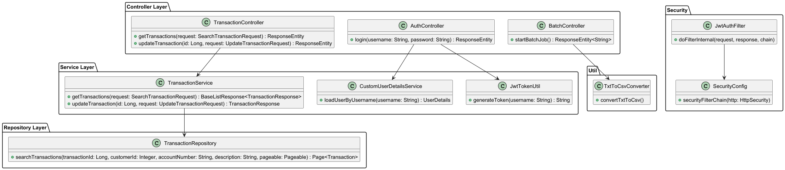
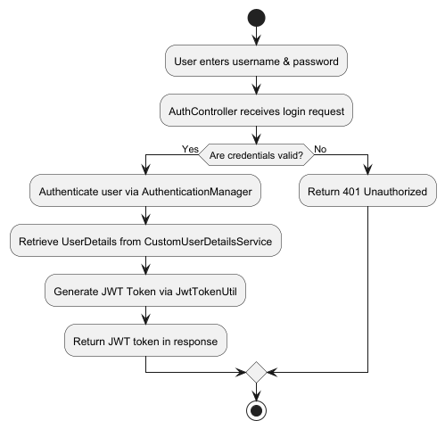
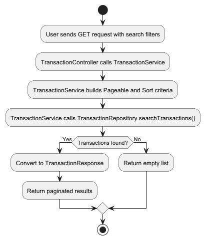
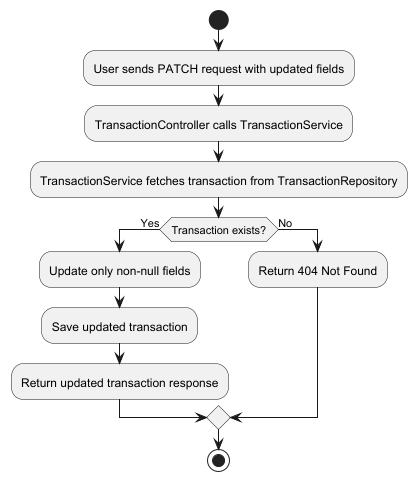

# Customer Transaction Service

## 1️⃣ Clone the Repository
```sh
git clone https://github.com/DzakirinMD/customer-transaction-service.git
cd customer-transaction-service
```

## 2️⃣ Start the Services
Run all services using **Docker Compose**:
```sh
mvn clean package
docker-compose up --build -d
```

## 3️⃣ Login Credentials
To log in and obtain a JWT token, use the following credentials:

```
👤 **Username:** admin
🔑 **Password:** admin
```

## 4️⃣ Connect to the Database
You can connect to the **PostgreSQL database** using the following credentials:

```
🔗 **Connection URL:** `jdbc:postgresql://localhost:5432/postgres`
👤 **User:** `postgres`
🔑 **Password:** `postgres`
📂 **Database:** `postgres`
```

## 5️⃣ Stop the Services
```sh
docker-compose down -v 
```

## Endpoints

| Endpoint                          | Authentication Required? | Description                          |
|-----------------------------------|--------------------------|--------------------------------------|
| `POST /auth/login`                | ❌ No                     | Login and get JWT token              |
| `GET /v1/batch/start`             | ❌ No                     | Start batch job without authentication |
| `GET /v1/transactions`            | ✅ Yes                    | Requires JWT token                   |
| `PATCH /v1/transactions/{id}`     | ✅ Yes                    | Requires JWT token                   |

## Diagrams

### Class Diagram


### Activity Diagram
##### - Login Flow


##### - Transaction Search Flow


##### - Transaction Update Flow

